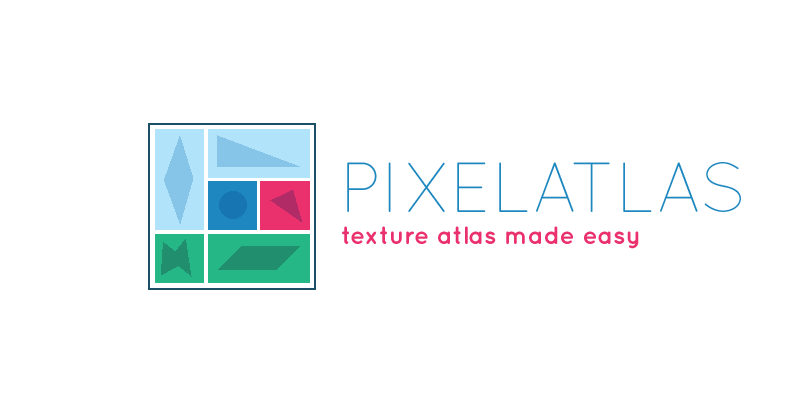

A LÖVE texture atlas loader from pixel information of an image.

## Example

```lua
local pixelatlas = require('pixelmap')

pixelatlas.register("#86a36bff")

local atlas = pixelatlas.load('atlas.png')

--[[
{
	<quad 1x1x16x16>,
	<quad 17x1x16x32>,
	...
}]]

```

See the complete sample : [./sample](./sample)

## Installation

Just copy the `pixelatlas.lua` file somewhere in your projects (maybe inside a `/lib/` folder) and require it accordingly.

## API

### Function `pixelatlas.register(color)`

Registers the quad separator color

### Function `pixelatlas.load(path) : Atlas`

Loads an image, reads each of its pixels and generate all quads from the atlas.

* *arg* `path` - `string` - `required` : path the image containing the atlas.
* *returns* An `Atlas` table


## Roadmap / Ideas

* Ad unit tests

## Copyright and license

MIT © [Aloïs Deniel](http://aloisdeniel.github.io)
